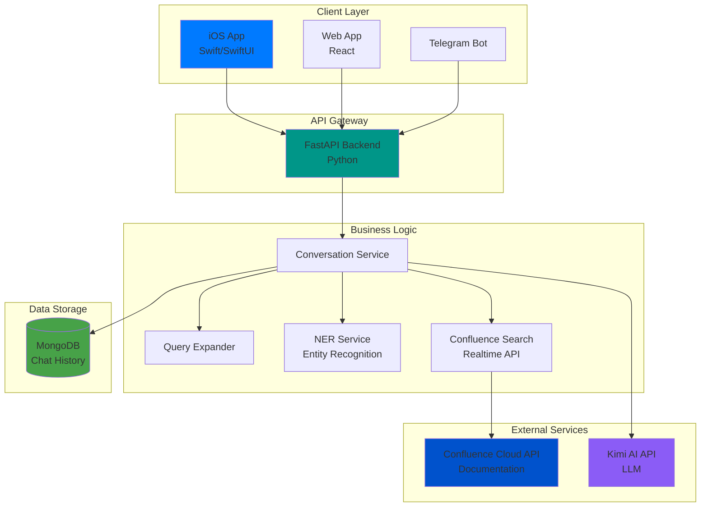
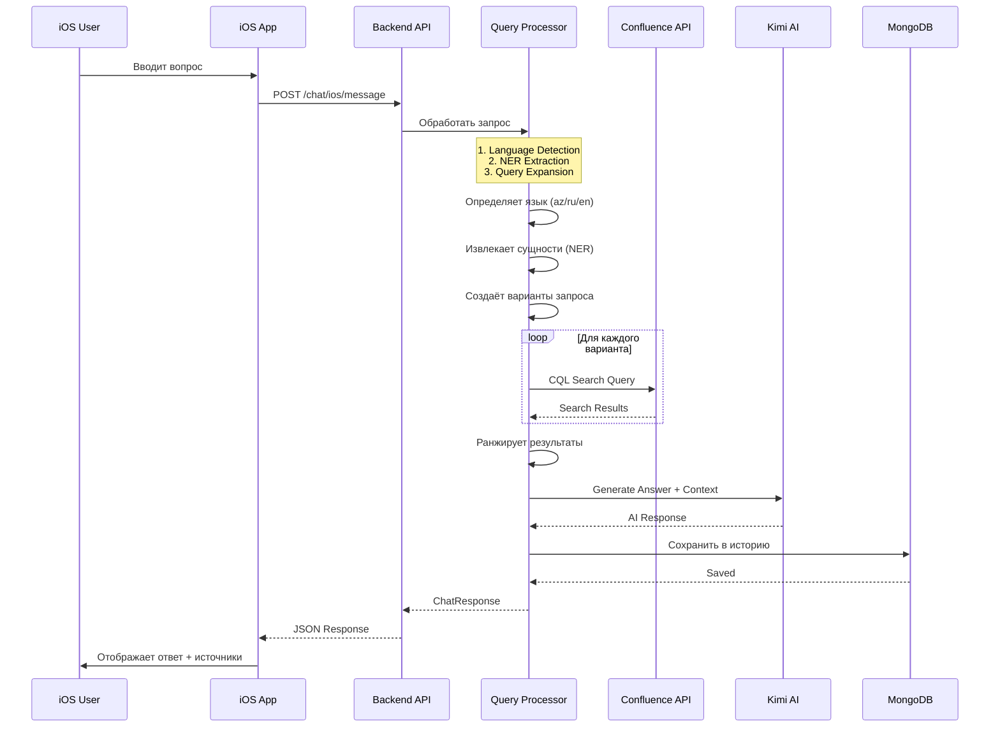
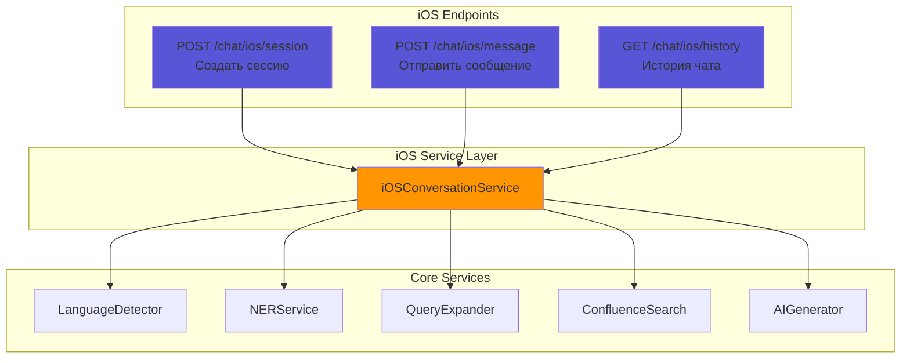
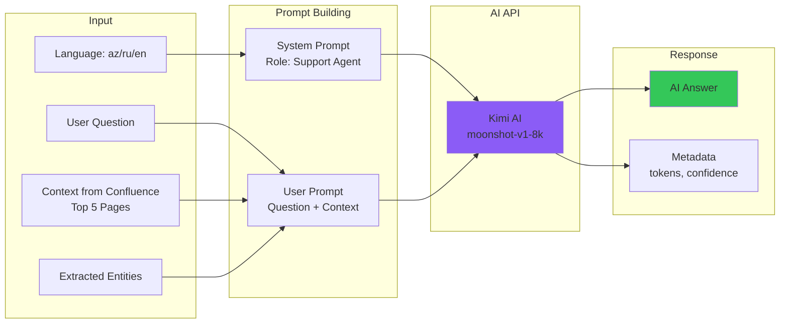
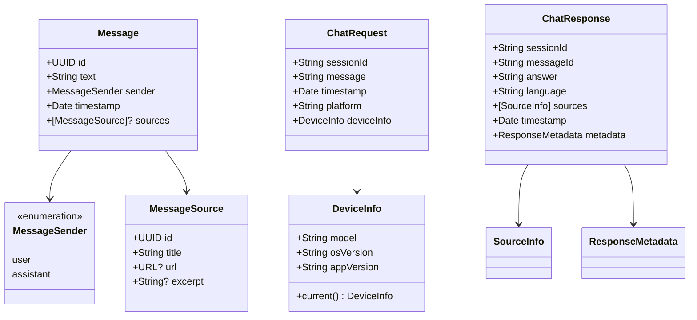
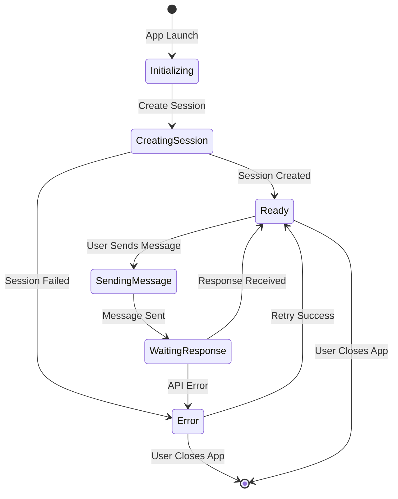
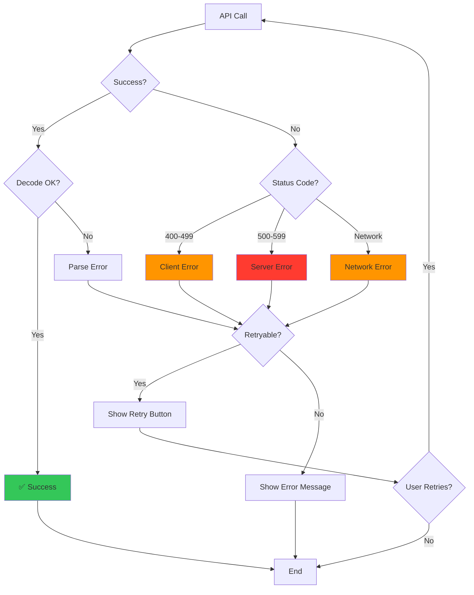
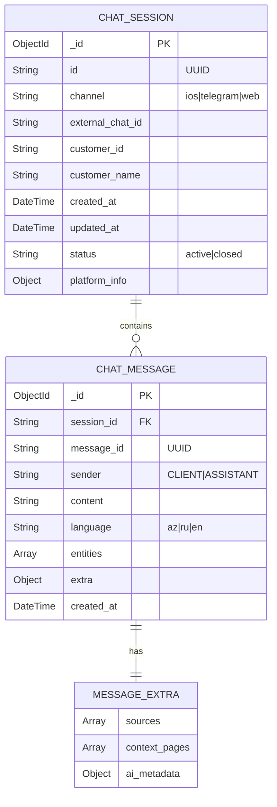
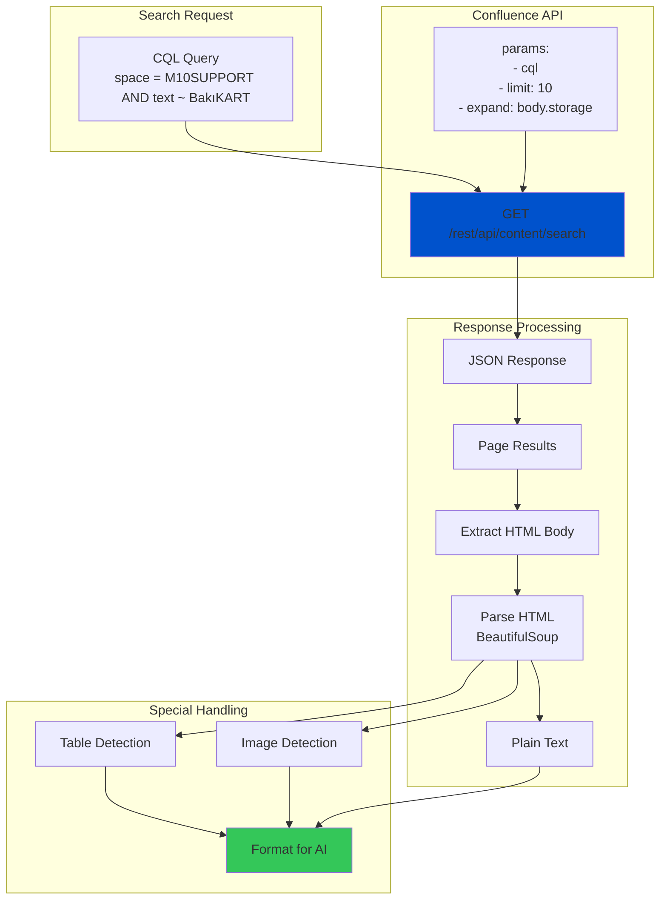
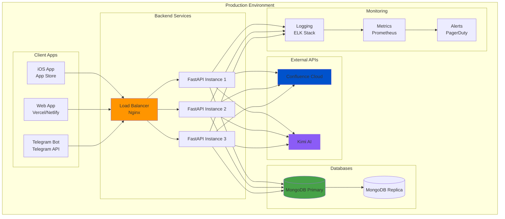

# Architecture Diagrams
## Визуальные схемы системы AI Support

---

## 1. Общая архитектура системы



---

## 2. Поток обработки сообщения



---

## 3. Архитектура iOS приложения

```mermaid
graph LR
    subgraph "Views"
        CV[ChatView]
        MB[MessageBubble]
        IB[InputBar]
        SV[SourcesView]
    end

    subgraph "ViewModels"
        CVM[ChatViewModel<br/>@StateObject]
    end

    subgraph "Services"
        API[APIService<br/>Singleton]
        NM[NetworkManager]
    end

    subgraph "Models"
        MSG[Message]
        SRC[MessageSource]
        REQ[ChatRequest]
        RES[ChatResponse]
    end

    CV --> CVM
    MB --> MSG
    IB --> CVM
    SV --> SRC

    CVM --> API
    API --> NM
    API --> REQ
    API --> RES

    CVM --> MSG

    style CV fill:#007AFF
    style CVM fill:#FF9500
    style API fill:#34C759
    style MSG fill:#AF52DE
```

---

## 4. Компоненты Backend для iOS



---

## 5. Процесс работы с Confluence API

```mermaid
graph TB
    Q[User Query:<br/>"BakıKART-a necə pul yükləyə bilərəm?"]

    subgraph "Query Processing"
        LD[Language Detection<br/>→ az]
        NER[NER Extraction<br/>→ BakıKART]
        EXP[Query Expansion]
    end

    subgraph "Expanded Queries"
        Q1["BakıKART-a necə pul yükləyə bilərəm?"]
        Q2["BakıKART balans artırma"]
        Q3["BakıKART pul yükləmə"]
        Q4["nəqliyyat kartı balans"]
    end

    subgraph "Confluence Search"
        CQL1[CQL: space = M10SUPPORT AND text ~ query1]
        CQL2[CQL: space = M10SUPPORT AND text ~ query2]
        CQL3[CQL: space = M10SUPPORT AND text ~ query3]
        CQL4[CQL: space = M10SUPPORT AND text ~ query4]
    end

    subgraph "Results Processing"
        R[Confluence Results]
        EXT[Extract Text from HTML]
        RANK[Rank by Relevance]
        TOP[Top 5 Results]
    end

    Q --> LD
    LD --> NER
    NER --> EXP

    EXP --> Q1
    EXP --> Q2
    EXP --> Q3
    EXP --> Q4

    Q1 --> CQL1
    Q2 --> CQL2
    Q3 --> CQL3
    Q4 --> CQL4

    CQL1 --> R
    CQL2 --> R
    CQL3 --> R
    CQL4 --> R

    R --> EXT
    EXT --> RANK
    RANK --> TOP

    style Q fill:#007AFF
    style TOP fill:#34C759
```

---

## 6. AI Response Generation Flow



---

## 7. Data Models (iOS)



---

## 8. State Management (iOS)



---

## 9. Error Handling Flow



---

## 10. MongoDB Collections Schema



---

## 11. Confluence API Integration



---

## 12. Deployment Architecture



---

## Пояснения к диаграммам

### Диаграмма 1: Общая архитектура
Показывает все компоненты системы и их взаимодействие на высоком уровне.

### Диаграмма 2: Sequence Diagram
Демонстрирует пошаговый поток обработки одного сообщения от пользователя до получения ответа.

### Диаграмма 3: iOS Architecture
Детализирует структуру iOS приложения по паттерну MVVM.

### Диаграмма 4: Backend Components
Показывает специфичные для iOS эндпоинты и сервисы.

### Диаграмма 5: Confluence Processing
Объясняет как работает расширение запроса и поиск в Confluence.

### Диаграмма 6: AI Flow
Показывает процесс генерации ответа через Kimi AI.

### Диаграмма 7: Data Models
UML диаграмма классов для iOS моделей данных.

### Диаграмма 8: State Management
Диаграмма состояний приложения.

### Диаграмма 9: Error Handling
Логика обработки ошибок и retry механизм.

### Диаграмма 10: Database Schema
ER диаграмма MongoDB коллекций.

### Диаграмма 11: Confluence Integration
Детали работы с Confluence API.

### Диаграмма 12: Production Deployment
Архитектура продакшн окружения с масштабированием.

---

## Использование диаграмм

Эти диаграммы можно:
- Просматривать в GitHub (автоматический рендеринг Mermaid)
- Экспортировать в изображения через [Mermaid Live Editor](https://mermaid.live/)
- Вставлять в презентации
- Использовать для документации API
- Показывать новым разработчикам для быстрого onboarding
